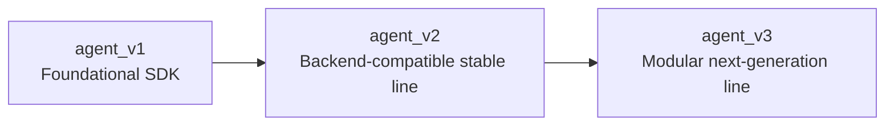

# LogarithmixAI Agent SDK


Structured Python observability SDKs created under [LogarithmixAI](https://github.com/LogarithmixAI) for collecting telemetry, logs, traces, performance signals, database activity, and framework-level request insights across multiple SDK generations.


## What This Repository Is

This repository is the versioned home of the LogarithmixAI Agent SDK line. It preserves the evolution of the SDK across foundational, backend-compatible, and modular next-generation stages so contributors and users can understand how the platform matured over time.



## Version Overview

| Version | Role | Best Use |
| --- | --- | --- |
| `agent_v1` | Foundational SDK baseline | Architecture history, early schema direction, reference |
| `agent_v2` | Stable backend-compatible SDK | Telemetry pipeline compatibility, recovery baseline, stable integration |
| `agent_v3` | Modular forward-looking SDK | New architecture, trace-oriented expansion, ongoing development |

## Repository Structure

```text
.
├── agent_v1/
│   ├── agent_sdk/
│   ├── pyproject.toml
│   └── README.md
├── agent_v2/
│   ├── agent_sdk/
│   ├── pyproject.toml
│   └── README.md
└── agent_v3/
    ├── agent_sdk/
    ├── pyproject.toml
    └── README.md
```

## Highlights

- Multi-version SDK preservation in one public repository
- Flask, FastAPI, and Django instrumentation support
- Secure event transport and structured telemetry schema
- Request, HTTP, logging, database, function, and span event capture
- Strong backward reference through preserved `agent_v2`
- Modular future path through `agent_v3`

## Installation Philosophy

This repository is designed to support smooth version selection and future upgrades with minimum user effort.

- First-time users should install a released SDK package or wheel for the version they need
- Stable integrations can stay pinned to a specific version
- Future upgrades should happen through an explicit version upgrade flow
- Older versions remain accessible through Git history, tags, and releases

Example version-specific installation model:

```bash
pip install logarithmixai-agent-sdk==2.0.0
pip install logarithmixai-agent-sdk==3.0.0
pip install --upgrade logarithmixai-agent-sdk
```

## Framework Coverage

| Capability | Flask | FastAPI | Django |
| --- | --- | --- | --- |
| Request monitoring | Yes | Yes | Yes |
| Exception capture | Yes | Yes | Yes |
| Logging capture | Yes | Yes | Yes |
| HTTP client monitoring | Yes | Yes | Yes |
| Database monitoring | Yes | Yes | Yes |
| Performance monitoring | Yes | Yes | Yes |

## How To Choose a Version

- Choose `agent_v1` if you want the earliest product baseline and schema foundation
- Choose `agent_v2` if backend telemetry pipeline compatibility is your priority
- Choose `agent_v3` if you want the modular architecture path and newer trace-oriented evolution

## Ownership

- Organization: [LogarithmixAI](https://github.com/LogarithmixAI)
- Public author identity: `ShubhamCoder-In`
- Built collaboratively under the LogarithmixAI engineering direction

## Roadmap Direction

- Preserve stable SDK history without losing compatibility context
- Publish versioned releases for users who need explicit install control
- Keep upgrade paths smoother so users do not need manual folder management
- Continue evolving the modular `agent_v3` line while retaining `agent_v2` as the compatibility anchor

## Final Note

This repository should be understood as the main versioned SDK home for LogarithmixAI, not just a single-version package snapshot.
